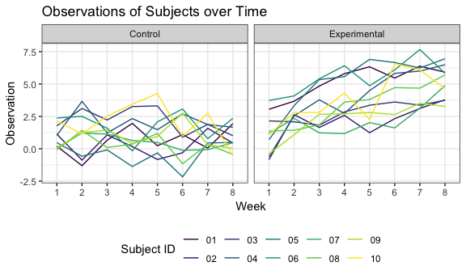

Homework 5: Iteration
================
Aakriti Gupta
November 9, 2018

Problem 1
=========

These data are from a longitudinal study that included a control arm and an experimental arm. Data for each participant is included in a separate file, and file names include the subject ID and arm.

Create a tidy dataframe
-----------------------

Create a tidy dataframe containing data from all participants, including the subject ID, arm, and observations over time

-   Start with a dataframe containing all file names; the list.files function will help
-   Iterate over file names and read in data for each subject using purrr::map and saving the result as a new variable in the dataframe
-   Tidy the result; manipulate file names to include control arm and subject ID, make sure weekly observations are “tidy”, and do any other tidying that’s necessary

``` r
## Creating a list of participant data file names
file_name_list = list.files("./data")

## Creating a function to read the csv files and add the respective file names
read_csv_iteration = function(data_files) {
  subject_data = 
    read_csv(file = str_c("./data/", data_files)) %>% 
    mutate(file = data_files)
}

## Reading in all the files in a combined dataset using a function and tidying the data
data_combined = 
  map_df(file_name_list, read_csv_iteration) %>% 
  gather(key = week, value = observation, week_1:week_8) %>% 
  separate(file, into = c("group", "subject"), sep = "_") %>% 
  mutate(week = str_replace(week, "week_", ""),
         subject = str_replace(subject,".csv",""),
         group = recode(group, "con" = "control", 
                        "exp" = "experimental"))
```

Make a spaghetti plot
---------------------

-   Make a spaghetti plot showing observations on each subject over time, and comment on differences between groups

``` r
data_combined %>% 
  mutate(group = recode(group, "control" = "Control", "experimental" = "Experimental")) %>% 
  ggplot(aes(x = week, y = observation, group = subject, color = subject)) + 
    geom_path() + 
    facet_grid(~group) + 
    labs(
      title = "Observations of Subjects over Time",
      x = "Week",
      y = "Observation"
    ) + 
    theme(legend.position = "bottom") +
    viridis::scale_color_viridis(
      name = "Subject ID", 
      discrete = TRUE
    )
```



These plots demonstrate that the observations of subjects in the control group remained fairly constant through the study period. On the other hand, the observations of subjects in the experimental group increased in value from week 1 through week 8.

Problem 2
=========

The Washington Post has gathered data on homicides in 50 large U.S. cities and made the data available through a GitHub repository.

Reading in the data from the GitHub repository
----------------------------------------------

``` r
wapo_homicide_url = "https://raw.githubusercontent.com/washingtonpost/data-homicides/master/homicide-data.csv"

wapo_homicide = 
  read.csv(url(wapo_homicide_url)) %>% 
  janitor::clean_names() %>% 
  as_tibble()
```

Describe the raw data
---------------------

This dataset has 52179 rows and 12 columns. Each row contains information about a single homicide that has occurred, including:

-   Location (city, state, latitude/longitude)
-   Information about the victim (first/last name, age, sex, disposition)
-   Information about the homicide (disposition, reported date, id).

These data have been reported from 50 cities in 28 states. 49% of the homicides were solved by arrest and the remaining are considered unsolved (solved with no arrest or still open/no arrest). 14% of the homicides had female victims.

Number of total and unsolved homicides by city
----------------------------------------------

Create a `city_state` variable (e.g. “Baltimore, MD”) and then summarize within cities to obtain the total number of homicides and the number of unsolved homicides (those for which the disposition is “Closed without arrest” or “Open/No arrest”).

``` r
  wapo_homicide_summary = wapo_homicide %>% 
  mutate(city_state = str_c(city, state, sep = ", ")) %>% 
  group_by(city_state) %>% 
  mutate(total_homicides_city = n()) %>% 
  filter(disposition %in% c("Closed without arrest", "Open/No arrest")) %>% 
  summarise(unsolved_homicides = n(),
            total_homicides = max(total_homicides_city)) 

wapo_homicide_summary %>% 
  rename("City, State" = city_state, "Unsolved Homicides" = unsolved_homicides, 
         "Total Homicides" = total_homicides) %>% 
  knitr::kable()
```

| City, State        |  Unsolved Homicides|  Total Homicides|
|:-------------------|-------------------:|----------------:|
| Albuquerque, NM    |                 146|              378|
| Atlanta, GA        |                 373|              973|
| Baltimore, MD      |                1825|             2827|
| Baton Rouge, LA    |                 196|              424|
| Birmingham, AL     |                 347|              800|
| Boston, MA         |                 310|              614|
| Buffalo, NY        |                 319|              521|
| Charlotte, NC      |                 206|              687|
| Chicago, IL        |                4073|             5535|
| Cincinnati, OH     |                 309|              694|
| Columbus, OH       |                 575|             1084|
| Dallas, TX         |                 754|             1567|
| Denver, CO         |                 169|              312|
| Detroit, MI        |                1482|             2519|
| Durham, NC         |                 101|              276|
| Fort Worth, TX     |                 255|              549|
| Fresno, CA         |                 169|              487|
| Houston, TX        |                1493|             2942|
| Indianapolis, IN   |                 594|             1322|
| Jacksonville, FL   |                 597|             1168|
| Kansas City, MO    |                 486|             1190|
| Las Vegas, NV      |                 572|             1381|
| Long Beach, CA     |                 156|              378|
| Los Angeles, CA    |                1106|             2257|
| Louisville, KY     |                 261|              576|
| Memphis, TN        |                 483|             1514|
| Miami, FL          |                 450|              744|
| Milwaukee, wI      |                 403|             1115|
| Minneapolis, MN    |                 187|              366|
| Nashville, TN      |                 278|              767|
| New Orleans, LA    |                 930|             1434|
| New York, NY       |                 243|              627|
| Oakland, CA        |                 508|              947|
| Oklahoma City, OK  |                 326|              672|
| Omaha, NE          |                 169|              409|
| Philadelphia, PA   |                1360|             3037|
| Phoenix, AZ        |                 504|              914|
| Pittsburgh, PA     |                 337|              631|
| Richmond, VA       |                 113|              429|
| Sacramento, CA     |                 139|              376|
| San Antonio, TX    |                 357|              833|
| San Bernardino, CA |                 170|              275|
| San Diego, CA      |                 175|              461|
| San Francisco, CA  |                 336|              663|
| Savannah, GA       |                 115|              246|
| St. Louis, MO      |                 905|             1677|
| Stockton, CA       |                 266|              444|
| Tampa, FL          |                  95|              208|
| Tulsa, OK          |                 193|              583|
| Washington, DC     |                 589|             1345|

Unsolved homicides in Baltimore
-------------------------------

For the city of Baltimore, MD, use the prop.test function to estimate the proportion of homicides that are unsolved; save the output of prop.test as an R object, apply the broom::tidy to this object and pull the estimated proportion and confidence intervals from the resulting tidy dataframe.

``` r
## Creating the function to run prop.test and applying broom::tidy
prop_homicide = function(df) {
  prop_test_homicide = prop.test(df$unsolved_homicides, df$total_homicides, 
            alternative = "two.sided", conf.level = 0.95, correct = FALSE)
  
  broom::tidy(prop_test_homicide) %>% 
    select(estimate, conf.low, conf.high)
}

## Applying the prop.test function applied to Baltimore, MD
wapo_homicide_summary %>% 
  filter(city_state == "Baltimore, MD") %>% 
  prop_homicide() %>% 
  rename("Proportion of Unsolved Cases in Baltimore" = estimate, 
         "Lower bound (95% CI)" = conf.low, 
         "Upper bound (95% CI)" = conf.high) %>% 
  knitr::kable()
```

|  Proportion of Unsolved Cases in Baltimore|  Lower bound (95% CI)|  Upper bound (95% CI)|
|------------------------------------------:|---------------------:|---------------------:|
|                                  0.6455607|             0.6277411|             0.6629852|
